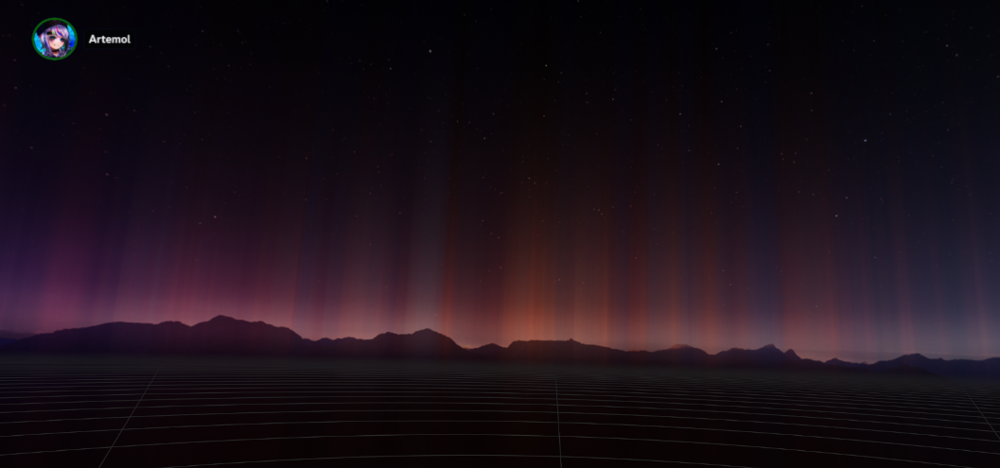

# DiscOverlay



Discordのボイスチャット接続状況をオーバーレイ表示します。

[Discord Streamkit Overlay](https://streamkit.discord.com/overlay)のVoice Widgetを使用して描画します。

## 機能

- DiscordのVC接続状況をオーバーレイ表示
  - サーバとチャンネルを指定し、特定のチャンネルで
- 位置調整
  - SteamVRのDashboardから位置と回転方向、サイズを調整できます
- カスタムURL
  - Streamkitから生成したURLを入力することで表示をカスタムできます

## 使い方

アプリケーションを起動するとコンフィグファイルが生成されます。

ファイルはUnityのpersistentDataPath以下にsettings.jsonとして生成され、起動した際にデスクトップに表示されるメインウィンドウの「Open File」ボタンを押下することでその場所を開くことが出来ます。

設定項目は次の通りです。

```json
{
  // VR空間内の相対座標
  // HMDを基準点にして指定します
    "x": 0.0,
    "y": 0.0,
    "z": 1.0,
  // 回転方向
    "rotationX": 0.0,
    "rotationY": 0.0,
    "rotationZ": 0.0,
  // 拡大倍率
    "size": 1.0,
  // ボイスチャンネルがあるサーバのID
    "serverId": "",
  // ボイスチャンネルのID
    "channelId": "",
  // Streamkitで生成したURL (Optional)
    "customUrl": ""
}
```

座標や回転方向、拡大倍率はVR内のDashboardからも設定できます。

# ライブラリ

## UniTask

The MIT License (MIT)

Copyright (c) 2019 Yoshifumi Kawai / Cysharp, Inc.

https://github.com/Cysharp/UniTask/blob/master/LICENSE

## Unity Web Browser

MIT License

Copyright (c) 2021-2024 Voltstro-Studios

https://github.com/Voltstro-Studios/UnityWebBrowser/blob/master/LICENSE.md

## SteamVR Unity Plugin

Copyright (c) Valve Corporation
All rights reserved.

Redistribution and use in source and binary forms, with or without modification,
are permitted provided that the following conditions are met

1. Redistributions of source code must retain the above copyright notice, this
list of conditions and the following disclaimer.

2. Redistributions in binary form must reproduce the above copyright notice,
this list of conditions and the following disclaimer in the documentation andor
other materials provided with the distribution.

3. Neither the name of the copyright holder nor the names of its contributors
may be used to endorse or promote products derived from this software without
specific prior written permission.

THIS SOFTWARE IS PROVIDED BY THE COPYRIGHT HOLDERS AND CONTRIBUTORS AS IS AND
ANY EXPRESS OR IMPLIED WARRANTIES, INCLUDING, BUT NOT LIMITED TO, THE IMPLIED
WARRANTIES OF MERCHANTABILITY AND FITNESS FOR A PARTICULAR PURPOSE ARE
DISCLAIMED. IN NO EVENT SHALL THE COPYRIGHT HOLDER OR CONTRIBUTORS BE LIABLE FOR
ANY DIRECT, INDIRECT, INCIDENTAL, SPECIAL, EXEMPLARY, OR CONSEQUENTIAL DAMAGES
(INCLUDING, BUT NOT LIMITED TO, PROCUREMENT OF SUBSTITUTE GOODS OR SERVICES;
LOSS OF USE, DATA, OR PROFITS; OR BUSINESS INTERRUPTION) HOWEVER CAUSED AND ON
ANY THEORY OF LIABILITY, WHETHER IN CONTRACT, STRICT LIABILITY, OR TORT
(INCLUDING NEGLIGENCE OR OTHERWISE) ARISING IN ANY WAY OUT OF THE USE OF THIS
SOFTWARE, EVEN IF ADVISED OF THE POSSIBILITY OF SUCH DAMAGE.
